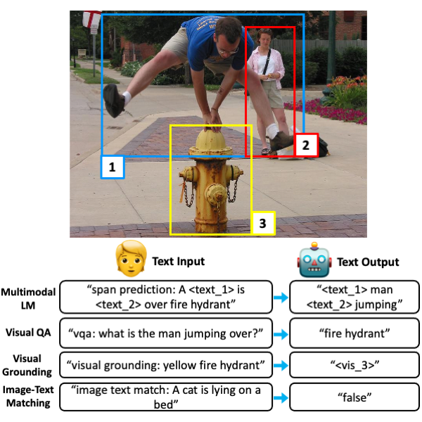

# Unifying Vision-and-Language Tasks via Text Generation

* Authors: [Jaemin Cho](https://j-min.io), [Jie Lei](https://www.cs.unc.edu/~jielei/), [Hao Tan](https://www.cs.unc.edu/~airsplay/), and [Mohit Bansal](https://www.cs.unc.edu/~mbansal/)
* [Paper](https://arxiv.org/abs/2102.02779) (To appear in [ICML 2021](https://icml.cc/Conferences/2021))
* [](https://colab.research.google.com/github/j-min/VL-T5/blob/main/inference_example.ipynb) (VQA inference using pretrained model on custom image/question)



## Setup
```bash
# Create python environment (optional)
conda create -n vlt5 python=3.7
source activate vlt5

# Install python dependencies
pip install -r requirements.txt

# Download T5/BART backbone checkpoint
python download_backbones.py

# For MSCOCO captioning evaluation (optional; for captioning only)
python -c "import language_evaluation; language_evaluation.download('coco')"
```

## Code structure
```bash
# Store images, features, and annotations
./datasets
    COCO/
        images/
        featuers/
    VG/
        images/
        features/
    GQA/
        images/
        features/
    nlvr/
        images/
        features/
    RefCOCO/

    ...

# Run feature extraction
./feature_extraction

# Train VL-T5
./VL-T5/
    src/
        modeling_t5.py modeling_bart.py                       <= VL-T5/VL-BART model classes
        pretrain.py, pretrain_data.py, pretrain_model.py      <= pretraining
        vqa.py, vqa_data.py vqa_model.py ...                  <= fine-tuning on downstream tasks (ex. VQA, GQA, NLVR2)
        multitask.py, multitask_data.py multiask_model.py     <= multitask learning on 7 downstream tasks
        param.py                                              <= (argparse) configuration
        tokenization.py                                       <= custom tokenizer
        utils.py, dist_utils.py                               <= utility functions
    snap/                                                     <= store weight checkpoints
    scripts/                                                  <= bash scripts for pretraining and finetuning
```

## API
```python
import sys
sys.path.append('./VL-T5/src')

# Parse configuration
from param import parse_args
args = parse_args(
    backbone='t5-base' # Backbone architecture
    load='./snap/pretrain/VLT5/Epoch30' # Pretrained checkpoint
    parse=False, # False for interactive env (ex. jupyter)
)
# Assign GPU
args.gpu = 0

# Load data loaders
from vqa_data import get_loader
train_loader = get_loader(
    args,
    split=args.train,
    ...
)
val_loader = get_loader(
    args,
    split=args.valid,
    ...
)
test_loader = get_loader(
    args,
    split=args.test,
    ...
)

# Import trainer
from vqa import Trainer
trainer = Trainer(
    args,
    train_loader=train_loader
    val_loader=val_loader
    test_loader=test_loader,
)

# model is attached to trainer
model = trainer.model

# Each task-specific model class is inherited from VLT5/VLBart classes, which are inherited from Huggingface transformers T5/BART classes
print(model)
>>> VLT5VQA(
    (shared): Embedding(...)
    (encoder): JointEncoder(...)
    ...
)

# Training
train_batch = next(iter(train_loader))
model.train_step(train_batch)
>>> {'loss': ... }

# Inference
test_batch = next(iter(test_loader))
model.test_step(test_batch)
>>> {'pred_ans': ... }
```

To add a new task, you can start with writing 3 files by editing from existing ones.
``` bash
NEW_TASK_model.py # Define a VLT5NewTask/VLBartNewTask model which inherits VLT5/VLBart class
NEW_TASK_data.py # Define Dataset/DataLoader/Evaluator
NEW_TASK.py # Define a trainer which inherits TrainerBase (trainer_base.py)
```

## Download Pre-trained models / Pre-extracted features
We host model checkpoints and features via google drive.
We recommend using [gdrive](https://github.com/prasmussen/gdrive) to download them.

## Pretrained Models
- Download `snap/` from [Google Drive](https://drive.google.com/drive/folders/1_SBj4sZ0gUqfBon1gFBiNRAmfHv5w_ph?usp=sharing)
```bash
gdrive download 1_SBj4sZ0gUqfBon1gFBiNRAmfHv5w_ph --recursive
```

### COCO+VG pretraining (default)
* `VL-T5/snap/pretrain/VLT5/Epoch30.pth`: VL-T5 pretrained for 30 epochs on COCO+VG
* `VL-T5/snap/pretrain/VLBart/Epoch30.pth`: VL-BART pretrained for 30 epochs on COCO+VG

### VCR pretraining (2nd stage)
* `VL-T5/snap/vcr_pretrain/VLT5/Epoch20.pth`: VL-T5 further pretrained for 20 epochs on VCR
* `VL-T5/snap/vcr_pretrain/VLBart/Epoch20.pth`: VL-BART further pretrained for 20 epochs on VCR


## Dataset Preparation / Feature extraction
- Download `datasets/` from [Google Drive](https://drive.google.com/drive/folders/1MBBhlkP83VMKS2Qe0SmFfzkHhMpIG5wf?usp=sharing)
```bash
gdrive download 1MBBhlkP83VMKS2Qe0SmFfzkHhMpIG5wf --recursive
```

  - Multi30K only
    - `git clone --recursive https://github.com/multi30k/dataset ./datasets/multi30k-dataset`
    - unzip `train.en.gz`, `val.en.gz`, `test_2017_flickr.en.gz`, `test_2018_flickr.en.gz` in `./datasets/multi30k-dataset/data/task1/raw/`
    - unzip `train.de.gz`, `val.de.gz`, `test_2017_flickr.de.gz`, `test_2018_flickr.de.gz` in `./datasets/multi30k-dataset/data/task1/raw/`
- For manual feature extraction, please checkout [./feature_extraction](./feature_extraction)

## Pretraining on COCO+VG
```bash
# Pretraining with 4 gpus
cd VL-T5/
bash scripts/COCOVG_pretrain_VLT5.sh 4
bash scripts/COCOVG_pretrain_VLBart.sh 4
```

## Downstream tasks

### [VQA](https://visualqa.org/)
```bash
# Finetuning with 4 gpus
cd VL-T5/
bash scripts/VQA_VLT5.sh 4
bash scripts/VQA_VLBart.sh 4
```

### [GQA](https://cs.stanford.edu/people/dorarad/gqa/)
```bash
# Finetuning with 4 gpus
cd VL-T5/
bash scripts/GQA_VLT5.sh 4
bash scripts/GQA_VLBart.sh 4
```

### [NLVR2](http://lil.nlp.cornell.edu/nlvr/)
```bash
# Finetuning with 4 gpus
cd VL-T5/
bash scripts/NLVR_VLT5.sh 4
bash scripts/NLVR_VLBart.sh 4
```

### [RefCOCOg](https://github.com/mjhucla/Google_Refexp_toolbox)
```bash
# Finetuning with 4 gpus
cd VL-T5/
bash scripts/RefCOCOg_VLT5.sh 4
bash scripts/RefCOCOG_VLBart.sh 4
```

### [VCR](https://visualcommonsense.com/)
```bash
# Pretraining on VCR with 4 gpus (optional)
cd VL-T5/
bash scripts/VCR_pretrain_VLT5.sh 4
bash scripts/VCR_pretrain_VLBart.sh 4

# Finetuning with 4 gpus
cd VL-T5/
bash scripts/VCR_VLT5.sh 4
bash scripts/VCR_VLBart.sh 4
```

### [COCO Caption](https://cocodataset.org/)
```bash
# Finetuning with 4 gpus
cd VL-T5/
bash scripts/COCOCaption_VLT5.sh 4
bash scripts/COCOCaption_VLBart.sh 4
```

### [Multi30K](https://github.com/multi30k/dataset)
```bash
# Finetuning with 4 gpus
cd VL-T5/
bash scripts/Multi30K_VLT5.sh 4
bash scripts/Multi30K_VLBart.sh 4
```


# Reference
Please cite our paper if you use our models in your works:
```bibtex
@inproceedings{cho2021vlt5,
  title     = {Unifying Vision-and-Language Tasks via Text Generation},
  author    = {Jaemin Cho and Jie Lei and Hao Tan and Mohit Bansal},
  booktitle = {ICML},
  year      = {2021}
}
```